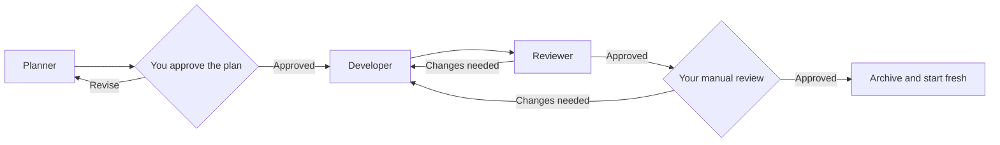

# Agentic Development Workflow

This folder contains a lightweight orchestration workflow for turning a larger
idea into small, reviewable changes. The agents divide the work between them,
but you stay in control of technical decisions, plan approval, and the final
review of every task.

If you want the complete reference, read the
[detailed workflow guide](GUIDE.md).

## 💡 Why and when to use this setup

This workflow is useful when a project spans several tasks, involves technical
decisions you want recorded, or needs independent review before each change is
accepted. It works especially well for longer projects that continue across
multiple agent sessions. For a small, low-risk edit, working with one agent
directly will usually be simpler.

## 🧱 Technologies covered

The current defaults are designed around Ruby on Rails with Pundit, Solid
Queue, RSpec, Hotwire and Tailwind CSS.
These are just my current preferences. Feel free to update the project values
in `.agent-context/planning/TECHNOLOGY.md` after initialization or adapt the existing
[`rules`](rules/README.md) to your own preferences.

I'd also appreciate contributions of new rules for other languages,
frameworks, tools, and conventions.

## 👥 Meet the team

- The [manager](subagents/manager.md) keeps the process moving and hands work
  between agents. It coordinates the project without touching project files.
- The [planner](subagents/planner.md) asks questions, records your decisions,
  and breaks the current milestone into small tasks you can approve.
- The [developer](subagents/developer.md) picks up one approved task, makes the
  code changes, and records what it changed and checked.
- The [reviewer](subagents/reviewer.md) independently inspects those changes,
  runs the appropriate validation, and sends any problems back to the
  developer.

The developer and reviewer can go around the loop more than once. Once the
reviewer is satisfied, the manager asks you to perform the final manual review.

## ⌨️ Commands

| Command | What it does |
| --- | --- |
| [`$start-work`](skills/start-work/SKILL.md) | Creates `.agent-context/` when needed and starts from [`PROJECT_BRIEF.md`](../PROJECT_BRIEF.md) |
| [`$start-work <goal>`](skills/start-work/SKILL.md) | Starts directly from a short goal supplied in the command |
| [`$resume-work`](skills/resume-work/SKILL.md) | Reconstructs the workflow from saved documents and continues from the correct step |
| [`$work-status`](skills/work-status/SKILL.md) | Tells you where things stand without changing or advancing anything |
| [`$approve-plan PLAN-NNN revision N`](skills/approve-plan/SKILL.md) | Approves the exact plan revision you reviewed |
| [`$review-task TASK-NNN approved`](skills/review-task/SKILL.md) | Records your manual approval of the current task |
| [`$review-task TASK-NNN changes: <feedback>`](skills/review-task/SKILL.md) | Sends your feedback into another developer-reviewer loop |

## 🚀 Basic usage

1. For a complex idea, fill in [`PROJECT_BRIEF.md`](../PROJECT_BRIEF.md), then run `$start-work`.
   For something easy to summarize in one line, use `$start-work <goal>`.
   The manager reads the intake and, when needed, asks the planner to create
   `.agent-context/` from the fixed templates before preparing a plan.
2. Answer the planner's clarification questions. No uncertain technical choice
   is silently assumed.
3. Review the proposed plan, then approve its exact identifier and revision
   with `$approve-plan PLAN-NNN revision N`.
4. Let the developer and reviewer complete their loop. Use `$work-status` at
   any point when you want an update without advancing the workflow.
5. When the manager asks for manual review, respond with
   `$review-task TASK-NNN approved` or send corrections with
   `$review-task TASK-NNN changes: <feedback>`.
6. Use `$resume-work` in a fresh conversation or after an interruption. The
   manager rebuilds context from the orchestration documents and continues
   from the recorded stage.

Each approved task is archived before the next cycle begins, so the active
documents stay focused on the work currently in progress.

## 🗂️ Framework and project context

- `.agents/` contains the reusable framework: agents, skills, rules, documents,
  and blank [context templates](templates/context/). It can be maintained as a
  separate repository and must not be changed by project workflow agents.
- [`PROJECT_BRIEF.md`](../PROJECT_BRIEF.md) is user-owned input for new work.
- `.agent-context/` is created by the planner on the first `$start-work`. It
  contains `CURRENT.md`, the roadmap, active plans, technology preferences,
  decisions, and history that belong only to this project.
- [rules/](rules/README.md) tells the planner and reviewer which engineering
  standards apply to a particular change.

The project context is the source of truth after initialization. Agents start
each new cycle fresh and load only the relevant context files rather than
depending on an increasingly long conversation.
