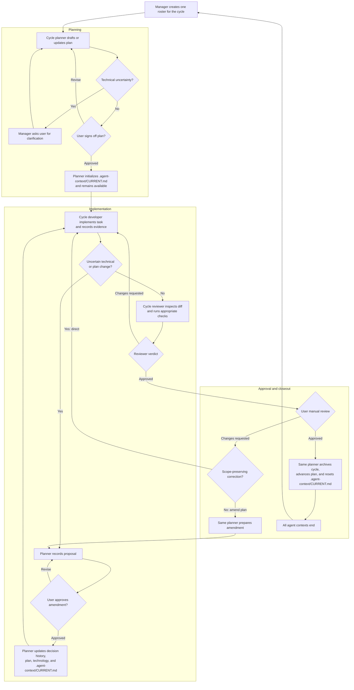

# Detailed agent orchestration guide

This directory defines a tool-agnostic workflow for planning, implementing,
reviewing, and manually approving project changes with specialized agents.

The workflow is intentionally sequential. One task is developed and reviewed
at a time, every plan requires user sign-off, and every completed task requires
user manual review.

## Roles

### Manager

The manager coordinates the workflow but never touches the project:

- starts the appropriate agent;
- relays questions, findings, and user feedback;
- enforces plan sign-off, review, validation, and manual-review gates;
- reads only the active pointer and current packet at startup, then delegates
  deeper state interpretation to the planner;
- retains the cycle's role contexts through all iterations, then ends them
  after closeout.

Definition: `subagents/manager.md`

### Planner

The planner inspects the project and maintains orchestration state:

- creates the roadmap and active milestone plan;
- batches technical clarification questions for the user;
- records approved technology decisions;
- selects applicable code rules and validation;
- initializes and closes task cycles;
- writes immutable task, decision, and milestone history.

The planner may edit orchestration documents but never project files.

Definition: `subagents/planner.md`

### Developer

The developer implements one approved current task:

- reads the current-cycle packet and relevant project code;
- follows the selected technology values and rule manifest;
- writes focused tests and implementation;
- runs developer-stage validation;
- records implementation evidence in the current packet;
- responds to reviewer and manual-review feedback.

Definition: `subagents/developer.md`

### Reviewer

The reviewer independently validates current changes:

- reviews the task diff from its recorded baseline;
- verifies scope, acceptance criteria, rules, and technology choices;
- reruns tests independently;
- expands validation when actual risk is greater than planned;
- records findings and the cycle-gate result;
- never edits project code.

Definition: `subagents/reviewer.md`

All role files use `model: inherit`. A runtime may replace this with
role-specific models later.

## Skills

Skills keep repeated procedures out of role context and load only when needed:

### User commands

| Skill | Purpose |
| --- | --- |
| [`start-work`](.agents/skills/start-work/SKILL.md) | Start planning a new goal |
| [`resume-work`](.agents/skills/resume-work/SKILL.md) | Continue entirely from persisted state |
| [`work-status`](.agents/skills/work-status/SKILL.md) | Report state without advancing it |
| [`approve-plan`](.agents/skills/approve-plan/SKILL.md) | Approve the latest active plan revision, with optional explicit identifiers |
| [`review-task`](.agents/skills/review-task/SKILL.md) | Submit manual approval or changes for the current task, with an optional task ID |

### Internal procedures

| Skill | Roles | Purpose |
| --- | --- | --- |
| [`manage-task-cycle`](.agents/skills/manage-task-cycle/SKILL.md) | Planner | Initialize, verify, resume, and close cycle state |
| [`select-validation`](.agents/skills/select-validation/SKILL.md) | Planner, developer, reviewer | Discover and select stage-appropriate checks |
| [`route-code-rules`](.agents/skills/route-code-rules/SKILL.md) | Planner, reviewer | Build and verify rule manifests from paths |

The manager delegates skill use but never executes these procedures itself.

### Responsibility boundaries

- **Communication:** the planner prepares questions and plans; only the manager
  presents them to the user.
- **Validation:** the developer owns developer-loop and handoff checks; the
  reviewer owns reviewer checks and the cycle gate. Commands repeat only when
  independent execution is explicitly justified.
- **Rule routing:** the planner owns the expected manifest; the reviewer checks
  it against actual changed paths; the developer only reports new paths.
- **State reads:** the manager reads `ACTIVE.md` and `CURRENT.md` for routing;
  the planner owns deeper plan, technology, decision, and history reads.

## Directory structure

```text
PROJECT_BRIEF.md

.agents/
├── README.md
├── GUIDE.md
├── subagents/
│   ├── manager.md
│   ├── planner.md
│   ├── developer.md
│   └── reviewer.md
├── skills/
│   ├── start-work/
│   ├── resume-work/
│   ├── work-status/
│   ├── approve-plan/
│   ├── review-task/
│   ├── manage-task-cycle/
│   ├── select-validation/
│   └── route-code-rules/
├── templates/
│   ├── PROJECT_BRIEF.md
│   └── context/
└── rules/
    ├── README.md
    ├── principles.md
    ├── security.md
    ├── tooling.md
    ├── validation.md
    ├── frontend/
    ├── javascript/
    └── ruby-on-rails/

.agent-context/                 # Created by $start-work
├── CURRENT.md
├── planning/
│   ├── ROADMAP.md
│   ├── ACTIVE.md
│   ├── TECHNOLOGY.md
│   └── plans/
└── history/
    ├── INDEX.md
    ├── cycles/
    ├── decisions/
    └── milestones/
```

`.agents/` is the fixed, reusable framework and can live in a separate Git
repository. `PROJECT_BRIEF.md` and `.agent-context/` belong to the consuming
project. Workflow agents never edit framework files or templates.

## Project context documents

### Work brief

`PROJECT_BRIEF.md` is a user-owned intake document for a new project, milestone,
or complex idea. When `$start-work` has no inline goal, the manager reads this
file and relays it to the planner without adding assumptions. Agents never edit
it, and it does not become part of the live context.

### Context initialization

When `.agent-context/` does not exist, the manager asks the upcoming cycle's
planner to use
`manage-task-cycle` to create it from `.agents/templates/context/`. Templates
are fixed framework files: the planner copies them but never edits them in
place. Initialization refuses to overwrite an existing context.

### Roadmap

`.agent-context/planning/ROADMAP.md` contains one short row per milestone. It
describes later work by outcome without prematurely creating detailed tasks.

The roadmap requires user approval. When a milestone becomes active, the
planner expands only that milestone into a detailed plan.

### Active milestone

`.agent-context/planning/ACTIVE.md` is a small pointer containing:

- current milestone ID;
- detailed plan path and revision;
- current status and next task;
- technology-profile revision.

Agents use this pointer instead of searching for a plan.

### Milestone plan

`.agent-context/planning/plans/PLAN-NNN.md` contains only pending and current
tasks for one milestone. Each task defines:

- outcome and scope;
- risk;
- dependencies;
- acceptance criteria;
- developer and reviewer checks;
- targeted or full cycle gate;
- manual checks;
- applicable rule files;
- required technology keys;
- unresolved blockers.

The plan must receive explicit user sign-off before any task becomes `ready`.
Completed tasks are removed after their immutable history records exist.

### Technology profile

`.agent-context/planning/TECHNOLOGY.md` contains only current approved values.
Tasks reference stable `TECH-NNN` keys and an exact profile revision.

Proposals, alternatives, and superseded values do not remain in the profile.
They are stored as immutable
`.agent-context/history/decisions/DEC-NNN.md` records after user approval.

### Current-cycle packet

`.agent-context/CURRENT.md` is the only in-flight handoff document. It contains:

- task contract and baseline;
- exact plan and technology revisions;
- applicable rules and relevant history paths;
- developer evidence;
- reviewer findings and validation;
- manual-review feedback;
- closeout state.

Ownership is section-based:

| Section | Owner |
| --- | --- |
| Identity, contract, manual review, closeout | Planner |
| Developer evidence | Developer |
| Reviewer evidence | Reviewer |
| Entire document | Manager is read-only |

Do not copy in-flight evidence into the milestone plan.

## History

History is immutable and sharded so it does not grow into one large context
file.

### Task cycles

Each approved task produces:

```text
.agent-context/history/cycles/PLAN-NNN/TASK-NNN.md
```

The record begins with the same short, plain-language summary shown during
manual review, so it is understandable without reading implementation detail.
It then records changes, validation, assumptions, decisions, reviewer
conclusions, manual approval, and the next task. Its milestone cycle index gets
one compact row.

### Decisions

Every approved technology change or plan amendment produces:

```text
.agent-context/history/decisions/DEC-NNN.md
```

The record preserves previous values, approved values, alternatives, reasoning,
approval, affected work, and resulting revisions. `TECHNOLOGY.md` retains only
the resulting current value.

### Milestones

When a milestone closes, the planner creates:

```text
.agent-context/history/milestones/PLAN-NNN.md
```

This summary becomes the default historical context for later milestones.
Agents open individual task records only when explicitly relevant.

## Workflow



### 1. Create or update the roadmap

1. Start the manager for the upcoming cycle.
2. The manager starts that cycle's planner.
3. The planner inspects the project and drafts outcome-level milestones.
4. The planner batches all uncertain technical questions.
5. The manager asks the user and relays the answers.
6. The planner updates the roadmap and technology decisions.
7. The manager presents the roadmap for explicit user sign-off.

### 2. Plan the active milestone

1. The planner promotes the next roadmap milestone.
2. It creates `.agent-context/planning/plans/PLAN-NNN.md`.
3. It creates `.agent-context/history/cycles/PLAN-NNN/INDEX.md`.
4. It updates `.agent-context/planning/ACTIVE.md`.
5. It divides the milestone into small vertical tasks.
6. It selects technology keys, rules, risk, and validation for every task.
7. The manager presents the detailed plan for user sign-off.

Later milestones remain outcome-level until promoted.

### 3. Initialize a task cycle

After plan approval, the planner:

1. selects the next `ready` task;
2. records a commit SHA as the baseline, or an explicit worktree baseline if no
   commit exists;
3. copies the approved task contract into `.agent-context/CURRENT.md`;
4. lists exact relevant cycle and decision record paths;
5. marks the plan task `in_progress`;
6. sets the current packet to `development`;
7. remains available for amendments, feedback, and closeout.

### 4. Develop

The manager starts the cycle's developer once. The developer:

1. reads `.agent-context/CURRENT.md`;
2. verifies plan and technology revisions;
3. reads only listed rules and history records;
4. inspects relevant project code;
5. implements the smallest complete change;
6. runs focused developer checks;
7. records changed files, results, assumptions, and risks;
8. notifies the manager that the packet is ready or blocked.

### 5. Review

The manager starts the cycle's reviewer once. The reviewer:

1. independently inspects the baseline diff;
2. verifies the rule manifest against actual changed paths;
3. reruns contract checks;
4. runs affected-area validation;
5. expands a targeted gate to full when risk requires it;
6. records findings and one verdict:
   `approved`, `changes_requested`, or `blocked`.

When changes are requested, the same developer and reviewer alternate until
approval. They receive follow-up tasks in their existing contexts; context
growth alone never creates a replacement agent.

### 6. Validate

Validation follows `rules/validation.md`:

| Stage | Purpose |
| --- | --- |
| Developer loop | Changed examples and nearest affected tests |
| Developer handoff | Focused tests, direct collaborators, changed-file checks |
| Reviewer | Independent checks and affected subsystem coverage |
| Cycle gate | Targeted by default; full when risk requires it |
| Milestone/release | Complete tests, system tests, style, security, dependencies |

Full cycle gates are required for migrations, dependencies, global
configuration, authentication, authorization, tenancy, security-sensitive or
cross-cutting changes, and milestone or release boundaries.

### 7. Manual review

The manager asks the user to review only after:

- the reviewer approves;
- acceptance criteria pass;
- the required cycle gate passes;
- the reviewer confirms the planned manual procedure matches the final result.

The request begins with a short, plain-language summary of what the completed
work now lets the user do. It then includes prerequisites, exact commands or
numbered actions, expected results, safe cleanup, and anything that must remain
unchanged. The user should never have to infer what changed or how to exercise
it.

For a clearly scope-preserving change request, `$review-task` sends the exact
feedback directly to the developer, bypassing the manager and planner.
The developer records and implements it, then hands it directly to the
reviewer. The reviewer must inspect the post-request changes and revalidate the
final task diff before the manager asks for manual review again.

Feedback that changes or may change scope, acceptance criteria, technology,
rules, dependencies, migrations, public contracts, authorization, or security
uses the normal manager-planner amendment path and requires sign-off. Only
explicit user approval completes manual review.

For `$review-task approved`, the skill resolves the task from `CURRENT.md` and
validates its reviewer verdict and gate directly. A supplied `TASK-NNN` must
match. It skips the manager and does not rerun project validation.

### 8. Close the task

The cycle's existing planner, using a bounded closeout document set:

1. writes `.agent-context/history/cycles/PLAN-NNN/TASK-NNN.md`;
2. updates that milestone's cycle index;
3. removes the task from its milestone plan;
4. exposes the next task;
5. resets `.agent-context/CURRENT.md` to `idle`.

All manager, planner, developer, and reviewer contexts then end.

### 9. Close the milestone

After its completion criteria pass, the planner:

1. creates `.agent-context/history/milestones/PLAN-NNN.md`;
2. updates the roadmap and root history index;
3. promotes the next milestone;
4. creates its plan and cycle index;
5. updates `ACTIVE.md`.

## Plan amendments and technology decisions

When implementation discoveries require a change:

1. The planner records the proposal in the active milestone plan.
2. Related questions are batched for the user.
3. The manager obtains explicit sign-off.
4. The planner allocates the next `DEC-NNN` ID.
5. It writes the immutable decision record and updates the decision index.
6. For technology changes, it increments the technology revision and replaces
   only the current profile value.
7. It increments the milestone plan revision.
8. It updates `.agent-context/CURRENT.md` when a task is active.
9. It removes the approved proposal from the active plan.

No agent may silently make an uncertain technical decision.

## Rule selection

`rules/README.md` routes rules by scope. Every project-change task includes:

- `rules/principles.md`;
- `rules/security.md`;
- `rules/tooling.md`;
- `rules/validation.md`.

The planner adds only applicable frontend, JavaScript, Rails, and testing rules.
The developer reads this manifest. The reviewer verifies it against actual
changed paths and reports omissions.

## Starting the workflow

For a new project:

1. Copy `.agents/templates/PROJECT_BRIEF.md` to `PROJECT_BRIEF.md` if the
   project does not already have one, then describe the idea there.
2. Run `$start-work`; the manager reads the brief and asks the planner to
   create `.agent-context/` before planning when it is absent.
3. Answer the planner's batched technical questions.
4. Review and approve the roadmap.
5. Review and approve the active milestone plan.
6. Allow the manager to begin the first task cycle.

Example request:

```text
$start-work
```

For a short idea, `$start-work <goal>` remains available without editing
`PROJECT_BRIEF.md`.

## Resuming the workflow

Ask the active cycle's existing manager to resume:

```text
$resume-work
```

The manager reads only the active pointer and current packet for routing. It
opens the referenced plan only for sign-off and the roadmap only for project or
milestone transitions. The planner performs deeper plan, technology, decision,
and history reconstruction.

Resume within the same orchestration thread while a cycle is active so its
role contexts remain reachable. New conversations are safe between closed
cycles; replacing an unavailable active-cycle role requires user approval.

## Recovery rules

- If `.agent-context/` is absent, use `$start-work`, not `$resume-work`.
- If `.agent-context/CURRENT.md` is `idle`, use `ACTIVE.md` to select the next
  task.
- If `.agent-context/CURRENT.md` is active, resume its recorded stage and
  baseline.
- If revisions do not match, stop and ask the planner to reconcile them.
- If an active cycle's agent context is unavailable, pause and ask the user
  before creating a replacement. Never replace it automatically.
- If a task record exists but the task remains in the plan, ask the planner to
  finish closeout rather than rerunning the task.
- Never reconstruct decisions from chat when an immutable decision record
  exists.

## Invariants

- User-facing chat is limited to brief phase starts, phase finishes, and input
  requests; detailed progress and evidence stay in `.agent-context/`.
- Manager never touches project files.
- Planner never implements project changes.
- Developer never changes plans or history.
- Reviewer never fixes reviewed code.
- No development starts without plan sign-off.
- No task closes without reviewer approval and user manual approval.
- Only one task cycle is active.
- Each role has at most one agent instance per active cycle; all corrections
  use follow-up tasks to those same instances.
- Active documents remain bounded to current work.
- Historical records are immutable and loaded by exact path.
- Framework files under `.agents/` are never modified during project work.

## Sharing the framework

The `.agents/` directory is designed to live in its own repository and can be
added to application repositories as a Git submodule or copied in as a
versioned toolkit. Project-specific history stays outside it in
`.agent-context/`, so framework upgrades do not mix with plans, decisions, or
cycle logs.

For a new project, copy `.agents/templates/PROJECT_BRIEF.md` to
`PROJECT_BRIEF.md`, describe the idea, and run `$start-work`.
