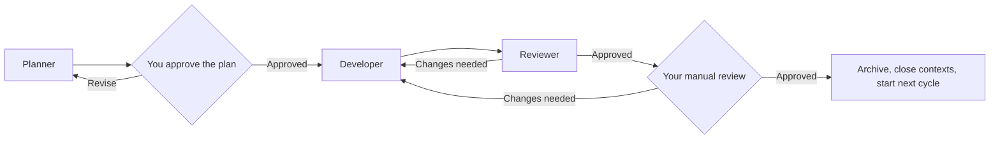

# Agentic Development Workflow

This folder contains a lightweight orchestration workflow for turning a larger
idea into small, reviewable changes. The agents divide the work between them,
but you stay in control of technical decisions, plan approval, and the final
review of every task.

If you want the complete reference, read the
[detailed workflow guide](GUIDE.md).

## 💡 Why and when to use this setup

This workflow is useful when a project spans several tasks, involves technical
decisions you want recorded, or needs independent review before each change is
accepted. It works especially well for longer projects that continue across
multiple agent sessions. For a small, low-risk edit, working with one agent
directly will usually be simpler.

## 🧱 Technologies covered

The current defaults are designed around Ruby on Rails with Pundit, Solid
Queue, RSpec, Hotwire and Tailwind CSS.
These are just my current preferences. Feel free to update the project values
in `.agent-context/planning/TECHNOLOGY.md` after initialization or adapt the existing
[`rules`](.agents/rules/README.md) to your own preferences.

I'd also appreciate contributions of new rules for other languages,
frameworks, tools, and conventions.

## 👥 Meet the team

- The [manager](.agents/subagents/manager.md) keeps the process moving and hands work
  between agents. It coordinates the project without touching project files.
- The [planner](.agents/subagents/planner.md) asks questions, records your decisions,
  and breaks the current milestone into small tasks you can approve.
- The [developer](.agents/subagents/developer.md) picks up one approved task, makes the
  code changes, and records what it changed and checked.
- The [reviewer](.agents/subagents/reviewer.md) independently inspects those changes,
  runs the appropriate validation, and sends any problems back to the
  developer.



## 📦 Install in a new project

The framework repository includes [`bin/agent-framework`](bin/agent-framework),
which installs the core separately from optional technology rules. Download the
script once, set your framework repository, and run it from the new project's
root:

```sh
curl -fsSLo /tmp/agent-framework \
  https://raw.githubusercontent.com/luisrocha/agents-workflow/main/bin/agent-framework
chmod +x /tmp/agent-framework
export AGENT_FRAMEWORK_REPO=https://github.com/luisrocha/agents-workflow.git

/tmp/agent-framework init
```

`init` creates `.agents/` in the current directory, including universal files directly under
`.agents/rules/`, but leaves out rule subfolders. It refuses to overwrite an
existing `.agents/` directory.

Add only the rule collections the project needs:

```sh
/tmp/agent-framework add-rules frontend javascript
/tmp/agent-framework add-rules ruby-on-rails
```

Rule names must match directories in the framework repository. Existing rule
folders are never overwritten. Set `AGENT_FRAMEWORK_REF` to pin a release tag
or branch.

## ⌨️ Commands

| Command | What it does |
| --- | --- |
| [`$start-work`](.agents/skills/start-work/SKILL.md) | Creates `.agent-context/` when needed and starts from [`PROJECT_BRIEF.md`](../PROJECT_BRIEF.md) |
| [`$start-work <goal>`](.agents/skills/start-work/SKILL.md) | Starts directly from a short goal supplied in the command |
| [`$resume-work`](.agents/skills/resume-work/SKILL.md) | Reconstructs the workflow from saved documents and continues from the correct step |
| [`$work-status`](.agents/skills/work-status/SKILL.md) | Tells you where things stand without changing or advancing anything |
| [`$approve-plan`](.agents/skills/approve-plan/SKILL.md) | Approves the latest active plan revision; optional plan and revision values are checked when supplied |
| [`$review-task approved`](.agents/skills/review-task/SKILL.md) | Records manual approval of the current task; an optional task ID is checked when supplied |
| [`$review-task changes: <feedback>`](.agents/skills/review-task/SKILL.md) | Sends a small correction for the current task directly to the developer; larger changes return to planning |

## 🚀 Basic usage

1. For a complex idea, fill in [`PROJECT_BRIEF.md`](PROJECT_BRIEF.md), then run `$start-work`.
   For something easy to summarize in one line, use `$start-work <goal>`.
   The manager reads the intake and, when needed, asks the planner to create
   `.agent-context/` from the fixed templates before preparing a plan.
2. Answer the planner's clarification questions. No uncertain technical choice
   is silently assumed.
3. Review the proposed plan, then run `$approve-plan`. It resolves the latest
   active plan and revision from saved state. You can still include either
   value when you want an explicit stale-state check.
4. Let the developer and reviewer complete their loop. Use `$work-status` at
   any point when you want an update without advancing the workflow.
5. When the manager asks for manual review, respond with
   `$review-task approved` or send corrections with
   `$review-task changes: <feedback>`. The current task is resolved from saved
   state; an optional task ID acts as a stale-state check. Small
   scope-preserving requests go directly to the developer and then the
   reviewer; plan-affecting requests return to the manager and planner.
6. Use `$resume-work` after an interruption in the same orchestration thread.
   It reconnects to the cycle agents and continues from the recorded
   stage. Start a fresh conversation only between closed cycles.

Each approved task is archived before the next cycle begins, so the active
documents stay focused on the work currently in progress.

## 🗂️ Framework and project context

- `.agents/` contains the reusable framework: agents, skills, rules, documents,
  and blank [context templates](.agents/templates/context/). It can be maintained as a
  separate repository and must not be changed by project workflow agents.
- [`PROJECT_BRIEF.md`](PROJECT_BRIEF.md) is user-owned input for new work.
- `.agent-context/` is created by the planner on the first `$start-work`. It
  contains `CURRENT.md`, the roadmap, active plans, technology preferences,
  decisions, and history that belong only to this project.
- [rules/](.agents/rules/README.md) tells the planner and reviewer which engineering
  standards apply to a particular change.
